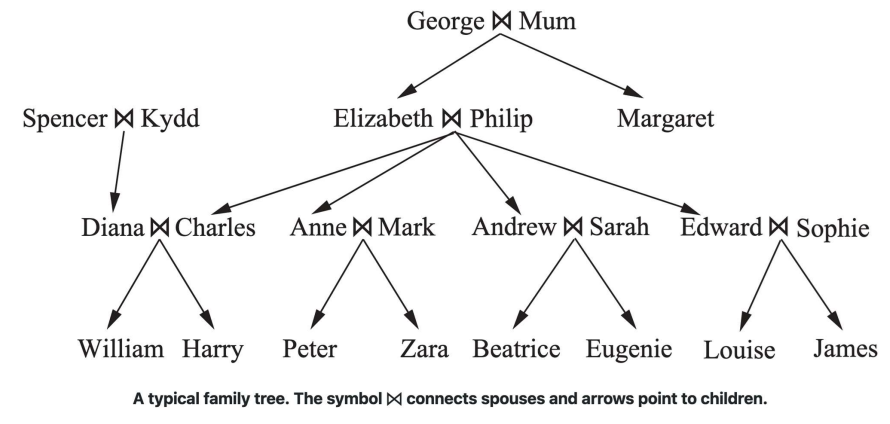

# Esercizi in Prolog
## [Kinship (albero genealogico)](kinship.pl)
Rappresentazione delle relazioni familiari come predicati.
  
  - Basato sull'albero genealogico mostrato nell'immagine seguente:

    

  - Il simbolo ⨝ collega i coniugi.
  - Le frecce indicano i figli.
